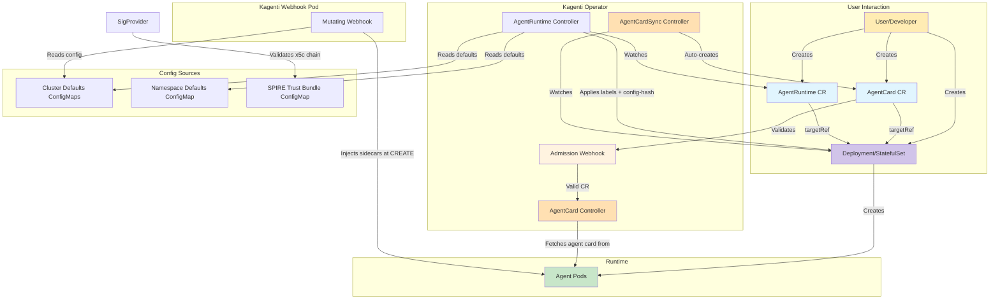

# Architecture

This document provides a detailed overview of the Kagenti Operator architecture, including its components, workflows, and design principles.

## Table of Contents

- [Overview](#overview)
- [Core Components](#core-components)
- [Architecture Diagram](#architecture-diagram)
- [Controller Architecture](#controller-architecture)
- [Security Architecture](#security-architecture)
- [Reconciliation Loops](#reconciliation-loops)
- [Deployment Modes](#deployment-modes)

---

## Overview

The Kagenti Operator is a Kubernetes controller that implements the [Operator Pattern](https://kubernetes.io/docs/concepts/extend-kubernetes/operator/) to automate the discovery and lifecycle management of AI agents. It follows a **Deployment-first model**: users create standard Kubernetes Deployments or StatefulSets, and the operator discovers them via `AgentCard` CRs with `targetRef`.

### Design Goals

- **Deployment-First**: Users create standard Kubernetes workloads; the operator handles discovery
- **Declarative Configuration**: Infrastructure as Code using Kubernetes CRDs
- **Security**: Signature verification, identity binding, RBAC, and least-privilege principles
- **Scalability**: Supports multiple agents concurrently
- **Cloud-Native**: Leverages native Kubernetes primitives and patterns

---

## Core Components

### Custom Resource Definitions (CRDs)

#### AgentCard CRD
- Provides dynamic discovery of AI agents via `targetRef`-based workload binding
- Fetches and caches agent metadata (A2A agent cards) from running workloads
- Supports signature verification and identity binding
- Stores agent capabilities, skills, and endpoint information

#### AgentRuntime CRD
- The declarative way to enroll a workload into the Kagenti platform
- Developer creates an AgentRuntime CR with `targetRef` — the controller applies labels and triggers injection
- Configures identity (SPIFFE) and observability (OTEL traces) per workload via 3-layer defaults (cluster → namespace → CR)
- Uses `targetRef` to reference backing workloads (Deployment, StatefulSet)
- The `kagenti.io/type` label applied by the controller triggers the webhook's `objectSelector`
- Developer workloads stay completely clean — no kagenti labels required in manifests

### Controllers

#### AgentCard Controller
- Watches AgentCard resources
- Resolves workloads via `targetRef` (Deployments, StatefulSets)
- Fetches agent cards from running workloads
- Verifies signatures and evaluates identity bindings
- Updates status with cached card data and conditions

#### AgentCardSync Controller
- Watches Deployments and StatefulSets with agent labels
- Automatically creates AgentCard resources for discovered workloads
- Sets owner references for garbage collection

#### AgentCard NetworkPolicy Controller
- Watches AgentCard resources when `--enforce-network-policies` is enabled
- Creates **permissive** NetworkPolicies for agents with verified signatures (and binding, if configured)
- Creates **restrictive** NetworkPolicies for agents that fail verification
- Resolves pod selectors from the backing workload's pod template labels

#### AgentRuntime Controller
- Watches AgentRuntime CRs, Deployments, StatefulSets, and ConfigMaps
- Applies `kagenti.io/type` label and `kagenti.io/config-hash` annotation to target workloads
- Computes config hash from 3-layer merged configuration (cluster defaults → namespace defaults → CR overrides)
- Triggers rolling updates when configuration changes (any layer)
- On CR deletion: preserves type label, updates config-hash to defaults-only, removes managed-by label
- Coordinates with the kagenti-extensions webhook which injects sidecars at Pod CREATE time

### Supporting Components

#### Webhook
- Validates AgentCard resources
- Ensures `targetRef` is set on AgentCards
- Mutates resources with default values

#### Signature Providers
- **X5CProvider**: Validates `x5c` certificate chains against the SPIRE X.509 trust bundle and verifies JWS signatures using the leaf public key

---

## Architecture Diagram



---

## Controller Architecture

### AgentCard Controller

The AgentCard Controller reconciles AgentCard CRs by resolving the backing workload via `targetRef`, fetching the agent card from the running agent, and storing the result in status.

#### Reconciliation Flow

```
1. Watch for AgentCard CR changes
2. Resolve workload via spec.targetRef (Deployment or StatefulSet)
3. Construct service URL for the agent
4. Fetch agent card from /.well-known/agent-card.json
5. Optionally verify signature (if --require-a2a-signature)
6. Evaluate identity binding (if spec.identityBinding configured)
7. Update AgentCard status:
   a. Store cached card data
   b. Set sync conditions
   c. Record signature verification result
8. Requeue after syncPeriod for next fetch
```

#### AgentCard Naming Convention

The controller maintains several conditions:

| Condition | Meaning |
|-----------|---------|
| `Synced` | Agent card fetched successfully from the workload |
| `Ready` | Agent card is available for discovery queries |

Examples:
- Deployment `weather-agent` -> AgentCard `weather-agent-deployment-card`
- StatefulSet `weather-agent` -> AgentCard `weather-agent-statefulset-card`

### AgentRuntime Controller

The AgentRuntime Controller reconciles AgentRuntime CRs by resolving the target workload, computing a config hash from the 3-layer merged configuration, and applying labels and annotations to trigger rolling updates and webhook injection.

#### Reconciliation Flow

```
1. Fetch AgentRuntime CR
2. Handle deletion (if marked for deletion):
   a. Preserve kagenti.io/type label on workload
   b. Update config-hash to defaults-only (triggers rollback)
   c. Remove managed-by label
   d. Remove finalizer
3. Ensure kagenti.io/cleanup finalizer is present
4. Resolve targetRef (verify Deployment/StatefulSet exists)
5. Compute config hash from merged configuration:
   a. Read cluster defaults (kagenti-webhook-defaults, kagenti-webhook-feature-gates)
   b. Read namespace defaults (ConfigMap with kagenti.io/defaults=true)
   c. Merge: cluster → namespace → CR spec (CR wins)
   d. Hash the merged result (deterministic SHA256)
6. Apply to target workload:
   a. kagenti.io/type label on workload metadata + PodTemplateSpec
   b. app.kubernetes.io/managed-by: kagenti-operator on workload metadata
   c. kagenti.io/config-hash annotation on PodTemplateSpec
7. Count configured pods and update status
```

#### Controller ↔ Webhook Interaction

The controller and the kagenti-extensions mutating webhook work together:

```
AgentRuntime CR created/updated
  → Controller applies kagenti.io/type label + config-hash annotation
    → PodTemplateSpec change triggers Kubernetes rolling update
      → New Pods created with kagenti.io/type label
        → Webhook's objectSelector matches → injects AuthBridge sidecars
```

| Concern | Controller | Webhook |
|---------|-----------|---------|
| Detect config change | Yes (3-layer merge + hash) | No |
| Trigger pod restart | Yes (annotation on PodTemplateSpec) | No |
| Read ConfigMap data | Yes (for hash computation) | Yes (for sidecar configuration) |
| Merge config values | Yes (same 3-layer merge) | Yes (independently) |
| Mutate pod spec | No | Yes (sidecar injection) |

#### Watches

| Resource | Scope | Purpose |
|----------|-------|---------|
| AgentRuntime | All namespaces | Primary resource |
| Deployment | All namespaces | Re-reconcile if target workload modified externally |
| StatefulSet | All namespaces | Re-reconcile if target workload modified externally |
| ConfigMap (cluster) | `kagenti-webhook-system` | Recompute hash when cluster defaults change |
| ConfigMap (namespace) | `kagenti.io/defaults=true` | Recompute hash when namespace defaults change |

#### Conditions

| Condition | Meaning |
|-----------|---------|
| `TargetResolved` | Target workload (Deployment/StatefulSet) exists |
| `Ready` | Labels and config-hash applied successfully |

### NetworkPolicy Controller

The NetworkPolicy Controller enforces network isolation based on signature verification.

#### Reconciliation Flow

```
1. Watch AgentCard resources (when --enforce-network-policies is enabled)
2. Resolve the workload and pod selector labels
3. Determine verification status:
   a. If identity binding configured: both signature AND binding must pass
   b. Otherwise: signature verification alone
4. Create permissive or restrictive NetworkPolicy
5. Clean up NetworkPolicy on AgentCard deletion
```

#### Policy Types

| Status | Policy | Effect |
|--------|--------|--------|
| Verified | Permissive | Allows traffic from/to other verified agents |
| Unverified | Restrictive | Blocks all traffic except DNS and operator |

---

## Security Architecture

### Signature Verification

The operator verifies JWS signatures embedded in agent cards per A2A spec section 8.4:

1. Extract `x5c` certificate chain from JWS protected header
2. Validate the chain against the SPIRE X.509 trust bundle
3. Extract the SPIFFE ID from the leaf certificate's SAN URI
4. Extract the leaf public key and verify the JWS signature (reject `none`, verify key type matches `alg`)
5. Create canonical JSON payload (sorted keys, no whitespace, `signatures` field excluded)
6. Reconstruct signing input: `BASE64URL(protected) || '.' || BASE64URL(canonical_payload)`
7. Verify the cryptographic signature against the leaf public key

Supported algorithms: RS256, RS384, RS512, ES256, ES384, ES512.

### Identity Binding

When `spec.identityBinding` is configured on an AgentCard:

1. The SPIFFE ID is extracted from the leaf certificate's SAN URI (proven by the x5c chain, not self-asserted)
2. The SPIFFE ID's trust domain is validated against the configured trust domain (`spec.identityBinding.trustDomain` or `--spire-trust-domain`)
3. Both signature AND binding must pass for the `signature-verified=true` label
4. NetworkPolicy enforcement uses this label for traffic control

---

## Security Model

### RBAC

The operator implements least-privilege access control:

#### Operator Permissions
- Read/Write: AgentCard CRs, AgentRuntime CRs
- Read/Update/Patch: Deployments, StatefulSets (for label/annotation application)
- Read: Services, Pods
- Read: ConfigMaps (cluster defaults + namespace defaults)
- Create/Patch: Events

### Secret Management

## Reconciliation Loops

### AgentCard Reconciliation

```go
func (r *AgentCardReconciler) Reconcile(ctx context.Context, req Request) (Result, error) {
    // 1. Fetch AgentCard
    agentCard := &AgentCard{}
    if err := r.Get(ctx, req.NamespacedName, agentCard); err != nil {
        return Result{}, client.IgnoreNotFound(err)
    }

    // 2. Resolve workload via targetRef (duck typing)
    workload, err := r.getWorkload(ctx, agentCard)

    // 3. Check workload readiness
    if !workload.Ready { ... }

    // 4. Get protocol and fetch agent card
    card, err := r.AgentFetcher.Fetch(ctx, protocol, serviceURL)

    // 5. Verify signature (if enabled)
    if r.RequireSignature {
        result, err := r.verifySignature(ctx, cardData)
    }

    // 6. Evaluate identity binding (if configured)
    if agentCard.Spec.IdentityBinding != nil {
        binding := r.computeBinding(agentCard, verifiedSpiffeID)
    }

    // 7. Update status and propagate labels
    r.updateAgentCardStatus(ctx, agentCard, ...)
    r.propagateSignatureLabel(ctx, workload, isVerified)

    return Result{RequeueAfter: syncPeriod}, nil
}
```

---

## Deployment Modes

### Cluster-Wide Mode

- Operator watches all namespaces
- Uses ClusterRole and ClusterRoleBinding
- Suitable for platform teams
- Single operator instance manages entire cluster

```yaml
apiVersion: rbac.authorization.k8s.io/v1
kind: ClusterRole
metadata:
  name: kagenti-operator-manager-role
rules:
  - apiGroups: ["agent.kagenti.dev"]
    resources: ["agentcards"]
    verbs: ["*"]
```

### Namespaced Mode

- Operator watches specific namespaces (via `NAMESPACES2WATCH` env var)
- Uses Role and RoleBinding per namespace
- Suitable for multi-tenant environments
- Multiple operator instances possible

```yaml
apiVersion: rbac.authorization.k8s.io/v1
kind: Role
metadata:
  name: kagenti-operator-manager-role
  namespace: team1
rules:
  - apiGroups: ["agent.kagenti.dev"]
    resources: ["agentcards"]
    verbs: ["*"]
```

---

## Performance and Scalability

### Resource Management

- Controllers use efficient caching (controller-runtime informers)
- Field indexers for fast AgentCard lookups by targetRef name
- Reconciliation includes backoff for transient errors
- Status updates use optimistic locking with retry

### Scaling Considerations

| Component | Scaling Strategy |
|-----------|------------------|
| Operator | Single replica (leader election optional) |
| Agents | Horizontal scaling via replicas field |
| AgentRuntimes | One per agent/tool workload |
| AgentCards | One per agent workload |
| NetworkPolicies | One per AgentCard (when enforcement enabled) |

### Monitoring

The operator exposes metrics via Prometheus:

- Reconciliation duration and error rates
- Signature verification counters, duration, and errors (`a2a_signature_verification_*`)

---

## Additional Resources

- [API Reference](./api-reference.md) — CRD specifications
- [Dynamic Agent Discovery](./dynamic-agent-discovery.md) — AgentCard discovery system
- [Signature Verification](./agentcard-signature-verification.md) — JWS signature setup guide
- [Identity Binding](./agentcard-identity-binding.md) — SPIFFE identity binding guide
- [Developer Guide](./dev.md) — Contributing to the operator
- [Getting Started](../GETTING_STARTED.md) — Tutorials and examples
